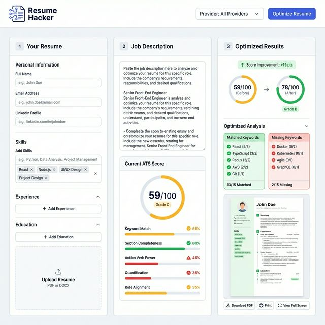

# ✨ Resume Hacker

**Resume Hacker** is an open-source AI resume optimizer that tailors your resume to a specific job description — maximizing your ATS (Applicant Tracking System) match score and helping you stand out to recruiters.



## 🚀 Features

- **Multi-Model AI Support** — Use cloud AI (OpenAI, Anthropic, Google Gemini, DeepSeek) or fully local AI (Ollama) to optimize your resume
- **Privacy First (Local AI)** — Keep sensitive resume data 100% local by running LLaMA 3, Mistral, or Gemma via Ollama
- **Live ATS Scoring** — Real-time ATS compatibility score with a full breakdown: keyword match, action verb strength, quantification, section completeness, and role alignment
- **Before & After Comparison** — See your ATS score before and after AI optimization with an animated score delta
- **Explicit Keyword Injection** — The AI prompt automatically extracts and injects missing ATS keywords (hard skills, soft skills, missing job title/education) into the prompt mandate ensuring near-perfect ATS scores, especially at higher intensities
- **Comprehensive Sections** — Support for extended resume sections like Certifications, Languages, Awards, Volunteer Work, and Publications
- **PDF Export with 3 Templates** — Download your optimized resume in Sidebar, Classic, or Executive layouts
- **Inline PDF Preview** — See the rendered resume in real-time without downloading
- **Optimization Intensity Slider** — Control how aggressively the AI rewrites your resume (0% = rephrase only → 100% = maximum ATS match)
- **Prompt-Only Mode** — Generate an optimized prompt to paste into ChatGPT or Claude yourself
- **Frictionless Mobile UX** — Installable as a Progressive Web App (PWA) with native OS "Share" sheet integrations and direct deep-links to ChatGPT and Claude apps, bypassing clunky mobile clipboards.
- **Bulletproof Validation** — Industry-standard error handling with Zod schema validation, pre-flight CTA UI guards, strict API validation, and auto-recovery for Ollama connection drops

## 🛠 Tech Stack

- **Framework**: [Next.js 15](https://nextjs.org/) (App Router, React 19)
- **Styling**: [Tailwind CSS](https://tailwindcss.com/)
- **UI Components**: [shadcn/ui](https://ui.shadcn.com/) (Radix UI primitives)
- **Animations**: [Framer Motion](https://www.framer.com/motion/)
- **AI Integration**: [Vercel AI SDK](https://sdk.vercel.ai/)
- **PDF Generation**: [@react-pdf/renderer](https://react-pdf.org/)
- **Local AI**: [Ollama](https://ollama.com/)

## 💻 Local Setup

### Prerequisites

- **Node.js** v18+
- **Ollama** (optional) — for fully local, private AI

### Steps

```bash
# 1. Clone
git clone https://github.com/yourusername/resume-hacker.git
cd resume-hacker

# 2. Install
npm install

# 3. Configure environment (optional — only needed for cloud AI providers)
cp .env.example .env.local
# Edit .env.local and add your API keys

# 4. Pull Ollama models (optional)
ollama pull llama3
ollama pull mistral

# 5. Run
npm run dev
```

Open [http://localhost:3000](http://localhost:3000).

## 🔑 Environment Variables

All keys are **optional**. If you only use Ollama, no configuration is needed.

| Variable                       | Provider                |
| ------------------------------ | ----------------------- |
| `OPENAI_API_KEY`               | OpenAI (GPT-4, GPT-3.5) |
| `ANTHROPIC_API_KEY`            | Anthropic (Claude)      |
| `GOOGLE_GENERATIVE_AI_API_KEY` | Google (Gemini)         |
| `DEEPSEEK_API_KEY`             | DeepSeek                |

> API keys can also be entered directly in the UI — they are never stored server-side.

## 🛣 Roadmap

- [ ] PDF upload → auto-parse resume into form fields
- [ ] Job description URL → auto-extract JD text
- [ ] Multiple resume slots (save & compare)
- [ ] One-click deploy to Vercel

## 🤝 Contributing

Contributions are very welcome! See [CONTRIBUTING.md](CONTRIBUTING.md) for guidelines.

## 📄 License

[MIT](LICENSE) — free to use, modify, and distribute.
